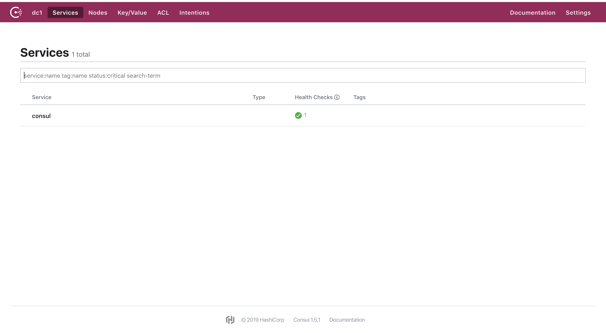

## Consul
### Preparation
Set up with `docker-compose.yaml` file:
```yaml
version: "3"
services:
  consul:
    image: consul
    container_name: consul
    ports:
      - "8300:8300"
      - "8400:8400"
      - "8500:8500"
      - "8600:53/udp"
```
then execute `docker-compose up`.
### Check for correctness
Open `http://localhost:8500` in browser. 
If you see the picture below, your consul is set up correctly.

### Usage for registry
#### Add dependency packages
```xml
<dependencies>
	<dependency>
		<groupId>org.springframework.boot</groupId>
		<artifactId>spring-boot-starter-actuator</artifactId>
	</dependency>
	<dependency>
		<groupId>org.springframework.cloud</groupId>
		<artifactId>spring-cloud-starter-consul-discovery</artifactId>
	</dependency>
</dependencies>
```
`spring-boot-starter-actuator`: health check dependency.

`spring-cloud-starter-consul-discovery`: Spring Cloud Consul support.
#### Add configurations
In `application.yml` add them:
```yaml
spring:
  apllication:
    name: spring-cloud-consul-producer
  cloud:
    consul:
      host: localhost
      port: 8500
      discovery:
        service-name: service-producer
server:
  port: 8501
```
`service-name`means the name that registered in consul, which will be used
for service allocation later.
#### Add annotation
In main java class:
```java
@SpringBootApplication
@EnableDiscoveryClient
public class ConsulProducerApplication {

	public static void main(String[] args) {
		SpringApplication.run(ConsulProducerApplication.class, args);
	}
}
```
Run it up and if you see another service comes up in `http://localhost:8500`,
you are glad to inform that service is registered.